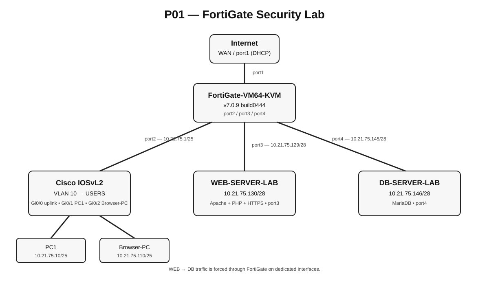

# 02 — Topología y arquitectura

## Topología

> **[INSERTAR DIAGRAMA FINAL]** `images/topology/topology.png`  
> Versión PNG de la topología final.

### Componentes

- **FortiGate-VM64-KVM**: punto central de enrutamiento y control de seguridad.
- **Cisco IOSvL2**: conectividad de la red de usuarios y VLAN 10.
- **Browser-PC**: cliente con navegador real para realizar pruebas.
- **WEB-SERVER-LAB**: servidor web Apache/PHP con HTTPS.
- **DB-SERVER-LAB**: servidor MariaDB.

`WEB-SERVER-LAB` y `DB-SERVER-LAB` están conectados a interfaces físicas dedicadas del FortiGate. Esto permite que el tráfico WEB → DB pase obligatoriamente por el firewall.

## Direccionamiento

| Dispositivo | Interfaz | Dirección | Prefijo | Gateway | Función |
|---|---|---:|---:|---:|---|
| FortiGate | port1 | DHCP | — | — | WAN / Internet |
| FortiGate | port2 | 10.21.75.1 | /25 | — | Usuarios |
| FortiGate | port3 | 10.21.75.129 | /28 | — | WEB |
| FortiGate | port4 | 10.21.75.145 | /28 | — | DB |
| PC1 | eth0 | 10.21.75.10 | /25 | 10.21.75.1 | Usuario / DHCP |
| Browser-PC | eth0 | 10.21.75.110 | /25 | 10.21.75.1 | Cliente de pruebas |
| WEB-SERVER-LAB | eth0 | 10.21.75.130 | /28 | 10.21.75.129 | Apache + PHP + HTTPS |
| DB-SERVER-LAB | eth0 | 10.21.75.146 | /28 | 10.21.75.145 | MariaDB |

## VLAN 10 — USERS

La red de usuarios utiliza **VLAN 10**, con nombre `USERS`.

Puertos de acceso configurados:

- `Gi0/0` → FortiGate `port2`.
- `Gi0/1` → PC1.
- `Gi0/2` → Browser-PC.

Los puertos restantes del switch se encuentran deshabilitados.

> **[INSERTAR CAPTURA]** `images/network/vlan10.png`  
> `show vlan brief` mostrando VLAN 10 y sus puertos.

## Flujo principal de tráfico

> **[INSERTAR DIAGRAMA]** `images/topology/traffic-flow.png`

El flujo previsto es:

`Browser-PC → FortiGate → destino`

y, para el acceso del servidor web a la base de datos:

`WEB-SERVER-LAB → FortiGate → DB-SERVER-LAB : 3306`

## Evidencias

> **[INSERTAR CAPTURA]** `images/topology/gns3-canvas.png`  
> Canvas completo de GNS3 con todos los nodos y enlaces visibles.
