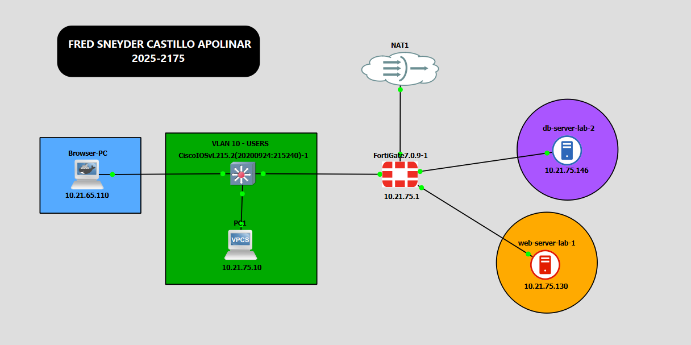
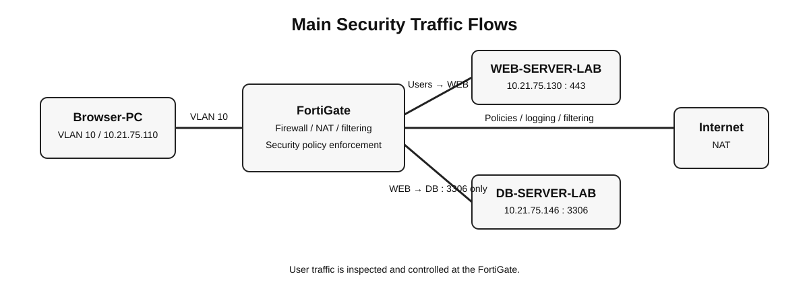

# 02 — Topología y arquitectura

## 2.1 Topología principal

La topología separa físicamente los segmentos de Usuarios, WEB y DB mediante interfaces dedicadas del FortiGate. Esto permite que el tráfico WEB → DB sea inspeccionado por una política de firewall real en lugar de circular directamente dentro de un mismo dominio de capa 2.

## 2.2 Direccionamiento

| Dispositivo | Interfaz | Dirección | Prefijo | Gateway | Función |
|---|---|---:|---:|---:|---|
| FortiGate | port1 | DHCP | — | DHCP | WAN / Internet |
| FortiGate | port2 | 10.21.75.1 | /25 | — | Usuarios |
| FortiGate | port3 | 10.21.75.129 | /28 | — | WEB |
| FortiGate | port4 | 10.21.75.145 | /28 | — | DB |
| PC1 | eth0 | 10.21.75.10 | /25 | 10.21.75.1 | Cliente DHCP |
| Browser-PC | eth0 | 10.21.75.110 | /25 | 10.21.75.1 | Cliente con navegador |
| WEB-SERVER-LAB | eth0 | 10.21.75.130 | /28 | 10.21.75.129 | Apache + PHP + HTTPS |
| DB-SERVER-LAB | eth0 | 10.21.75.146 | /28 | 10.21.75.145 | MariaDB |

## 2.3 VLAN de usuarios

El switch Cisco IOSvL2 utiliza únicamente **VLAN 10 — USERS** para el segmento de usuarios.

Puertos documentados:

- `Gi0/0` — uplink hacia FortiGate `port2`.
- `Gi0/1` — PC1.
- `Gi0/2` — Browser-PC.

Los puertos no utilizados fueron deshabilitados como parte del hardening básico.

## 2.4 Contenedores del laboratorio

### Browser-PC

Contenedor Docker basado en Debian Bookworm Slim con `firefox-esr`. Se utiliza para las pruebas desde un navegador real y mantiene una IP estática deliberada (`10.21.75.110/25`) para facilitar la trazabilidad de logs.

### WEB-SERVER-LAB

Contenedor Docker basado en Ubuntu 22.04 con Apache, PHP y `php-mysqli`. El servicio HTTPS utiliza un certificado autofirmado generado durante la construcción de la imagen.

### DB-SERVER-LAB

Contenedor Docker basado en Ubuntu 22.04 con MariaDB. La base `labdb` contiene la tabla `users` con los registros de laboratorio y el usuario `webuser` está restringido al origen del WEB Server.

## 2.5 Flujo de tráfico

Las relaciones principales son:

- Usuarios → Internet: permitido mediante política de salida y NAT.
- Usuarios → WEB: tráfico HTTPS controlado por la política `Usuarios_a_WEB`.
- Usuarios → DB: bloqueado por `Usuarios_a_DB_BLOQUEADO`.
- WEB → DB: permitido únicamente mediante `WEB_a_DB_solo_3306` y el servicio MySQL/TCP 3306.

## 2.6 Diseño de seguridad

El WEB Server y el DB Server no comparten un mismo segmento de capa 2. Cada servidor está conectado a una interfaz física independiente del FortiGate, garantizando que las políticas puedan inspeccionar y controlar el tráfico entre ambos segmentos.
