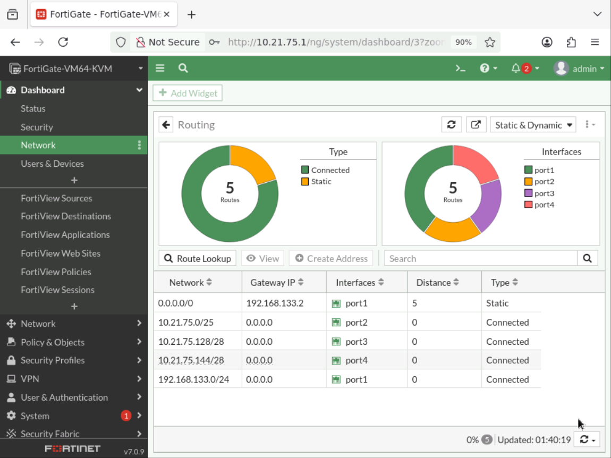
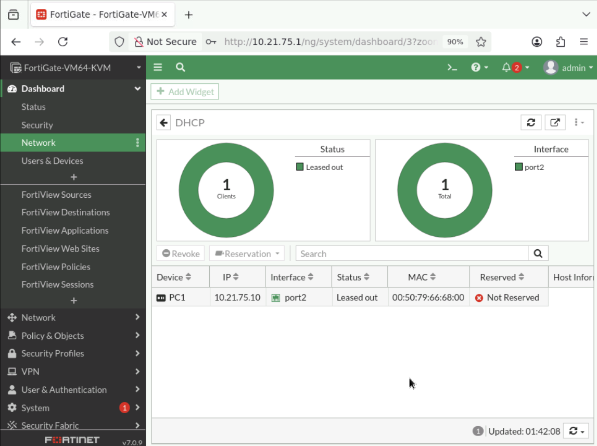
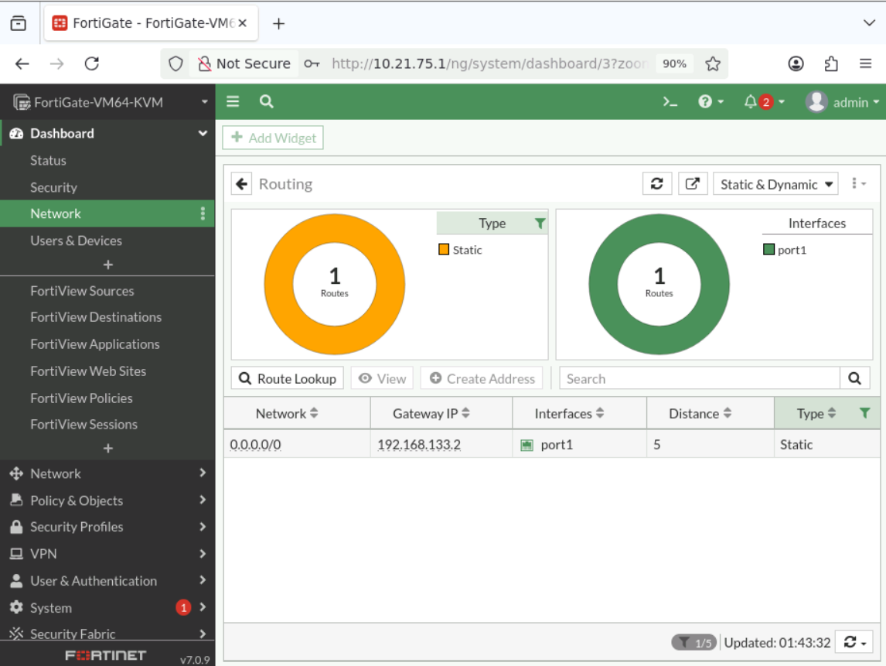
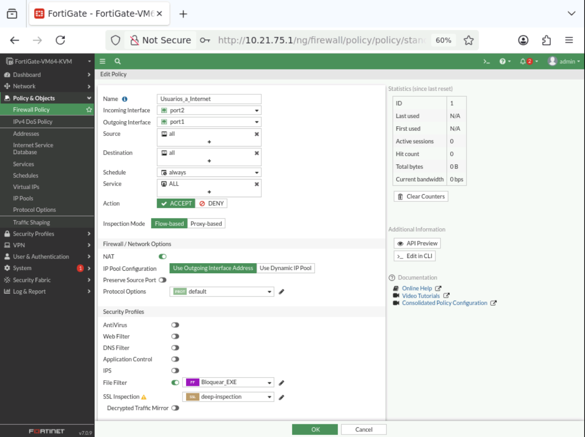
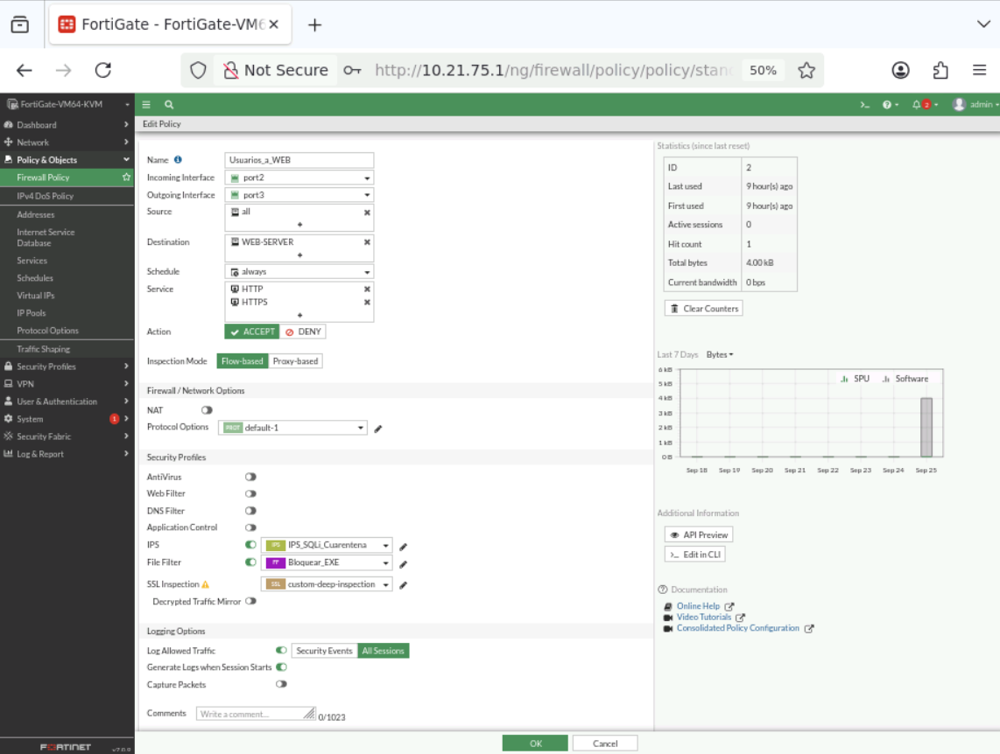
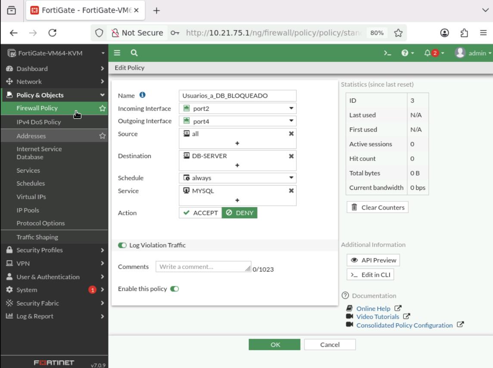
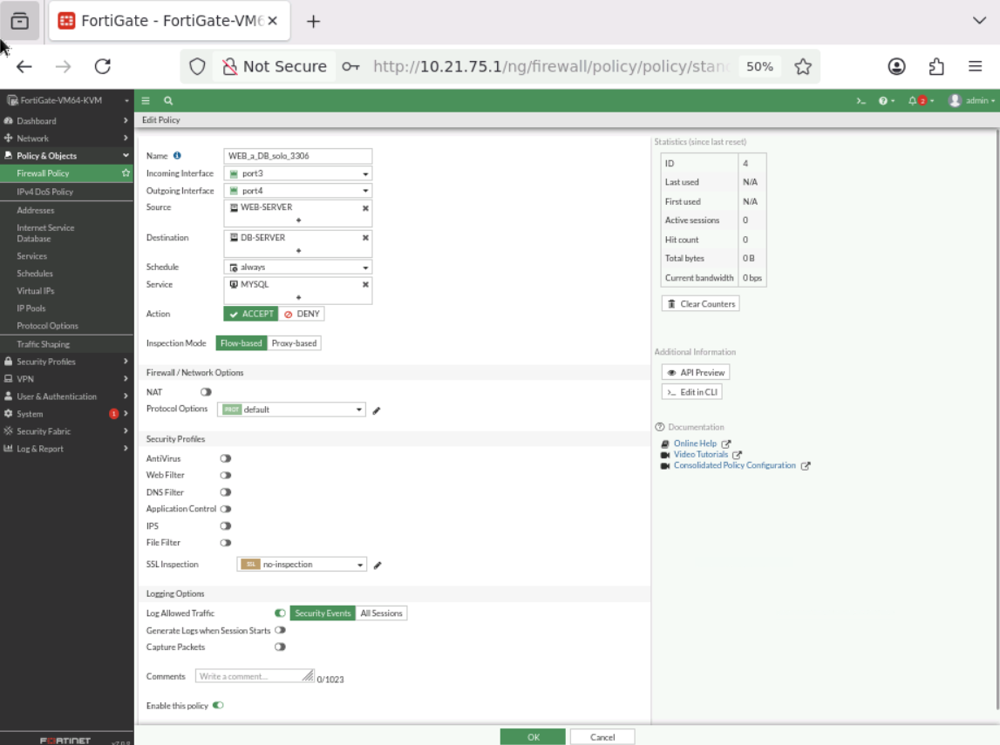
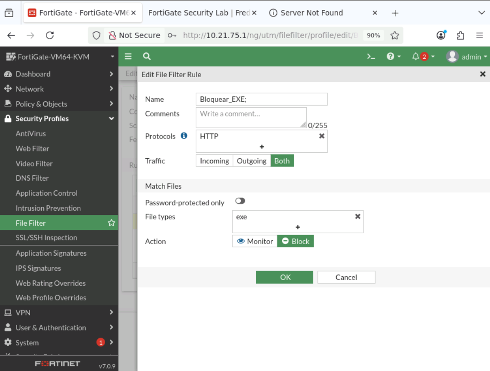
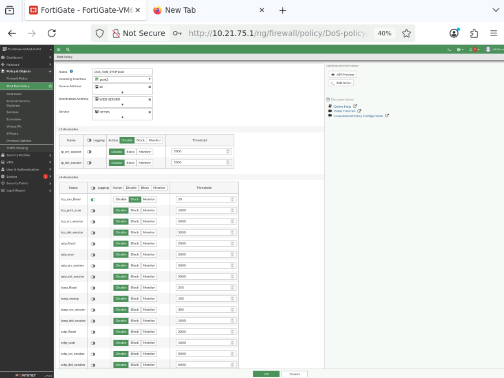

# 03 — Configuración y seguridad

> Esta sección resume la configuración que quedó implementada y verificada en el laboratorio. Las capturas enlazadas se renderizan automáticamente en GitHub cuando el archivo con el nombre indicado existe en la carpeta correspondiente.

## 3.1 Interfaces del FortiGate

La asignación inicial de IP se realizó por CLI para habilitar el acceso a la GUI. A partir de ese punto, la configuración de políticas y perfiles se realizó mediante GUI.

Configuración:

- `port1`: DHCP para WAN.
- `port2`: `10.21.75.1/25` para Usuarios.
- `port3`: `10.21.75.129/28` para WEB.
- `port4`: `10.21.75.145/28` para DB.

## 3.2 DHCP — VLAN 10

Ruta GUI: **Network → Interfaces → port2 → DHCP Server**.

Rango documentado: `10.21.75.10`–`10.21.75.100`, máscara `255.255.255.128`, gateway igual a la interfaz.

PC1 confirmó posteriormente `10.21.75.10/25` con gateway `10.21.75.1`.

## 3.3 Ruta por defecto

Ruta GUI: **Network → Static Routes → Create New**.

- Destination: `0.0.0.0/0.0.0.0`
- Interface: `port1`
- Gateway: valor configurado en el entorno WAN

## 3.4 NAT y salida a Internet

La política `Usuarios_a_Internet` permite la salida desde el segmento de usuarios hacia `port1` con NAT habilitado.

La validación se realizó desde Browser-PC mediante conectividad IP y navegación externa después de corregir el DNS del contenedor.

## 3.5 Política Usuarios → WEB

Ruta GUI: **Policy & Objects → Firewall Policy → `Usuarios_a_WEB`**.

La política controla el acceso del segmento de usuarios hacia `WEB-SERVER-LAB`.

## 3.6 Política Usuarios → DB

Ruta GUI: **Policy & Objects → Firewall Policy → `Usuarios_a_DB_BLOQUEADO`**.

La política utiliza acción **DENY** para impedir que los usuarios alcancen el servicio MySQL del DB Server.

## 3.7 WEB → DB únicamente TCP/3306

Ruta GUI: **Policy & Objects → Firewall Policy → `WEB_a_DB_solo_3306`**.

La política permite al WEB Server acceder al DB Server mediante el servicio MySQL/TCP 3306 y no autoriza otros servicios.

## 3.8 File Filter — bloqueo de `.exe`

Ruta GUI: **Security Profiles → File Filter → `Bloquear_EXE`**.

El perfil fue asociado a las políticas de tráfico web correspondientes. La prueba final se realizó con un ejecutable Windows real (`procexp.exe`) para que la clasificación del archivo dependiera de su contenido y firma real, no solo de la extensión.

## 3.9 Rate limiting / protección DoS

Ruta GUI: **Policy & Objects → IPv4 DoS Policy → `DoS_Anti_SYNFlood`**.

Control documentado:

- `tcp_syn_flood`: habilitado.
- Logging: habilitado.
- Action: `Block`.
- Threshold: `20`.

La prueba utilizó tráfico SYN generado desde el laboratorio y el log mostró detecciones y sesiones limpiadas por el control.

## 3.10 Switch — VLAN y seguridad básica

La VLAN 10 `USERS` se creó y asignó a `Gi0/0`–`Gi0/2`. También se aplicaron controles básicos en los puertos de acceso: port-security, BPDU Guard, `nonegotiate` y deshabilitación de puertos no utilizados.

## 3.11 Archivos técnicos

Los scripts de construcción de las imágenes Docker se encuentran en `files/scripts/` y las configuraciones exportadas se almacenan en `files/configs/`.

> **Pendiente de incorporación:** exportación final de configuración de FortiGate. Se añadirá al repositorio después de revisar que no contenga secretos o claves sensibles.
