# 04 — Testing and compliance

## 4.1 Validation matrix

| Demonstrated requirement | Implementation | Test | Result |
|---|---|---|---|
| Default route | `0.0.0.0/0` via `port1` | `ping 8.8.8.8` + external browsing | ✅ Verified |
| NAT | `Usuarios_a_Internet` with NAT enabled | Browser-PC traffic to Internet | ✅ Verified |
| Users → WEB | `Usuarios_a_WEB` | Browser-PC access to WEB Server | ✅ Verified in the documented functional test |
| Users → DB blocked | `Usuarios_a_DB_BLOQUEADO` | Attempt to `10.21.75.146:3306` + Forward Traffic | ✅ Verified |
| WEB → DB only 3306 | `WEB_a_DB_solo_3306` | Positive 3306 test and negative tests on 22, 80, 21, 23, 25, 53, 443, 3389, 3606 and 8080 | ✅ Verified |
| `.exe` File Filter | `Bloquear_EXE` | `procexp.exe` download and session interruption | ✅ Verified |
| Rate limiting / DoS | `DoS_Anti_SYNFlood` | `hping3` SYN flood + Security Events | ✅ Verified |
| VLAN 10 | Switch `VLAN 10 / USERS` | `show vlan brief` | ✅ Verified |
| Basic switch security | Port-security, BPDU Guard, nonegotiate and unused ports shutdown | `show running-config` + `show interfaces status` | ✅ Verified |
| 2 servers /28 | WEB and DB in `/28` | Apache/HTTPS and MariaDB services | ✅ Verified |
| Users /25 + DHCP | VLAN 10 + DHCP on `port2` | `ip dhcp` + `show ip all` on PC1 | ✅ Verified |

## 4.2 Main evidence

### Users → DB blocked

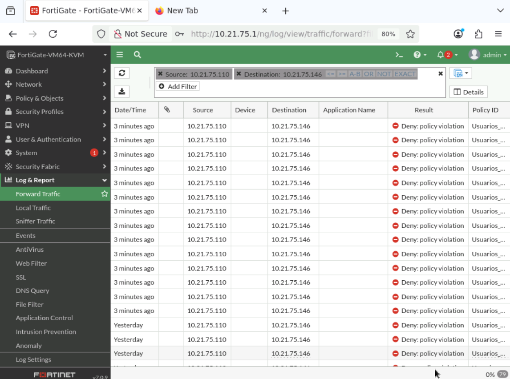

The Forward Traffic log identifies `Usuarios_a_DB_BLOQUEADO` and records the connection as a policy violation.

### WEB → DB: 3306 allowed

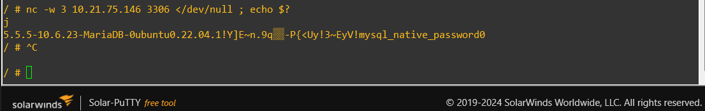

### WEB → DB: other ports blocked

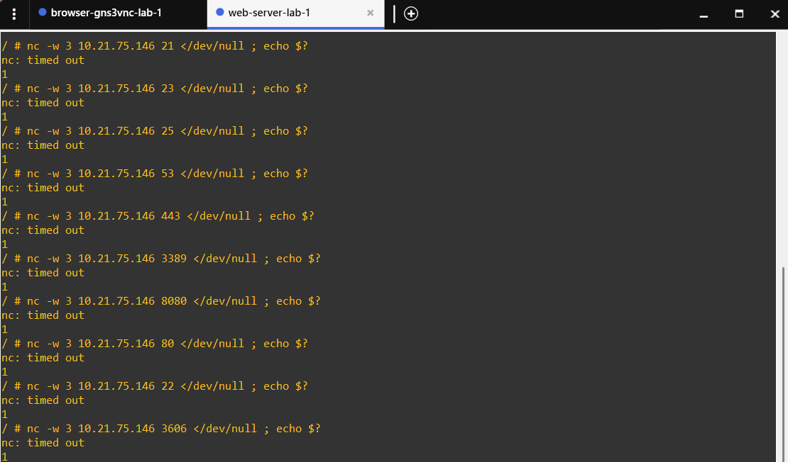

The documented additional ports were **22, 80, 21, 23, 25, 53, 443, 3389, 3606 and 8080**. The only allowed port in the test was **3306**.

### File Filter

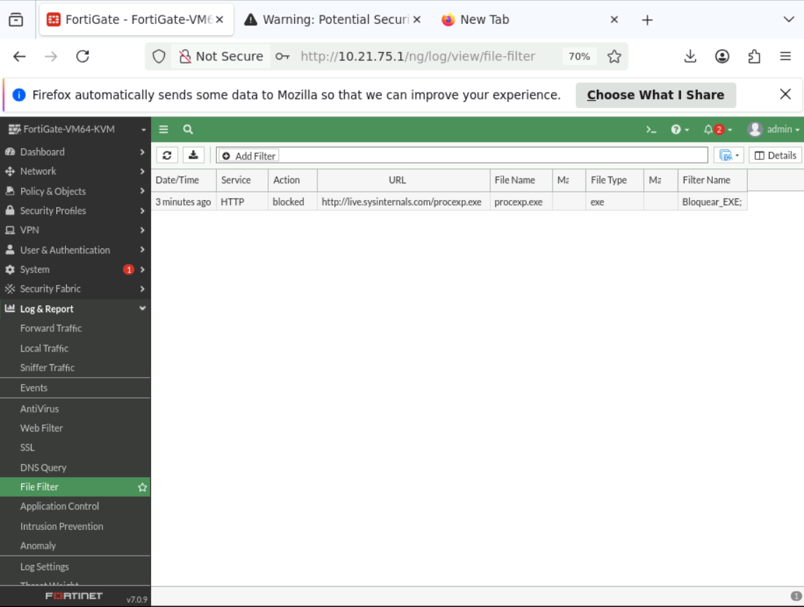

The final test used a real Windows executable and observed the transfer being interrupted by the Flow-based File Filter control.

### SYN flood

Security Events evidence shows `tcp_syn_flood` detections and `clear_session` actions after the configured threshold was exceeded.

## 4.3 DHCP evidence

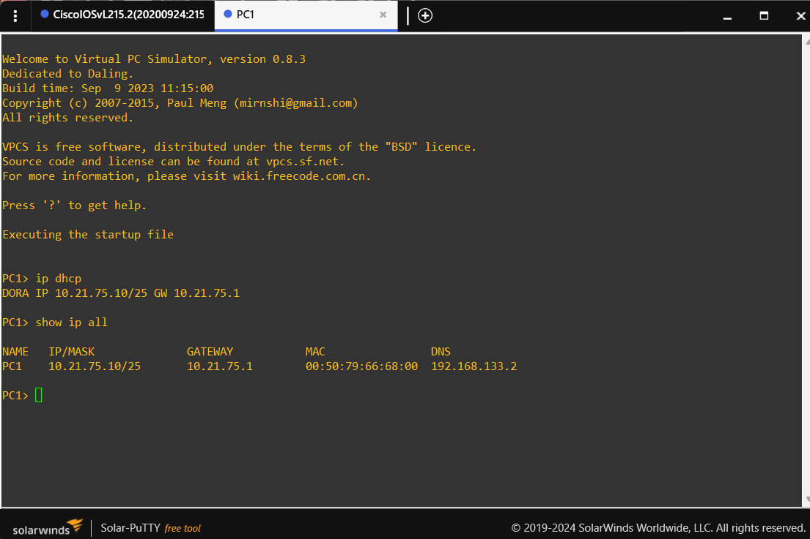

The `10.21.75.10/25` address and `10.21.75.1` gateway confirm the expected assignment within the user segment.

## 4.4 Infrastructure evidence

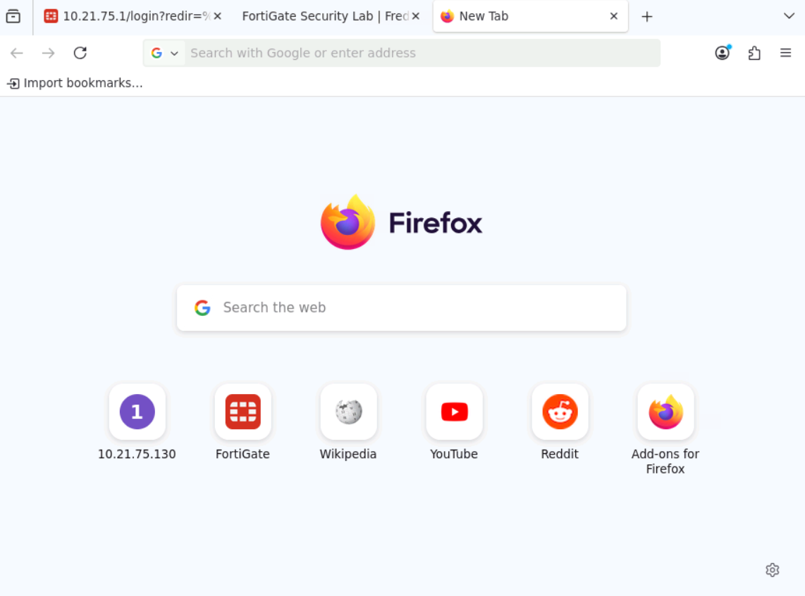

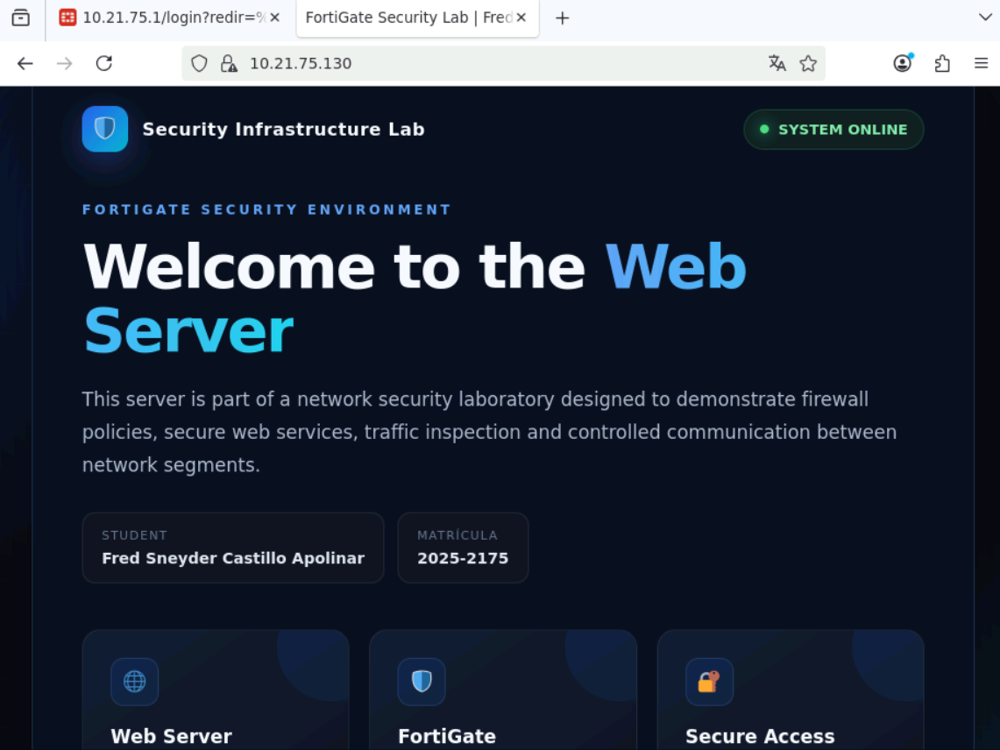

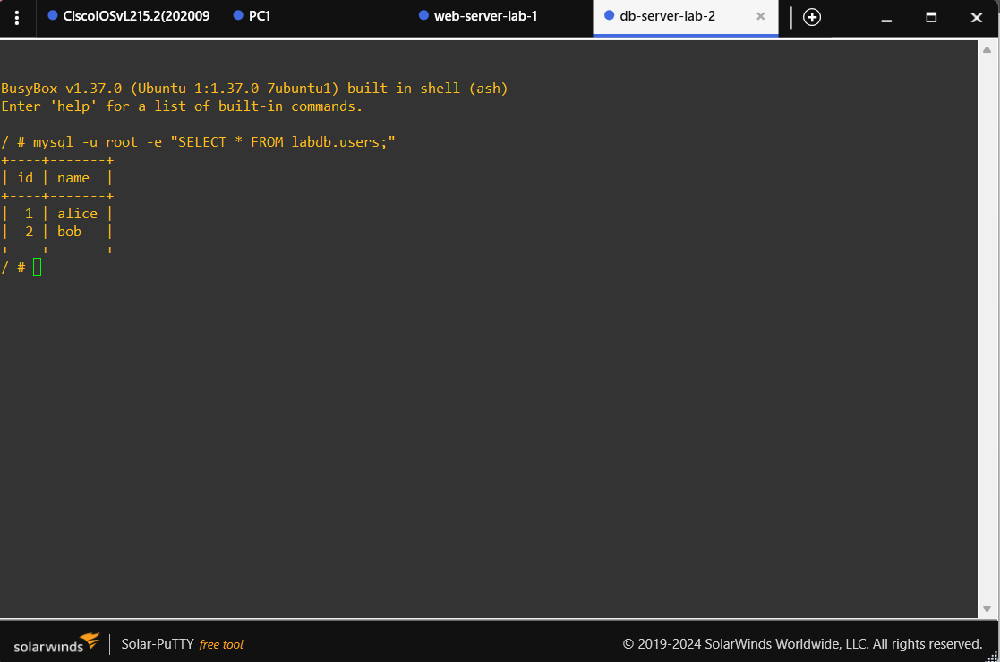

## 4.5 Switch evidence

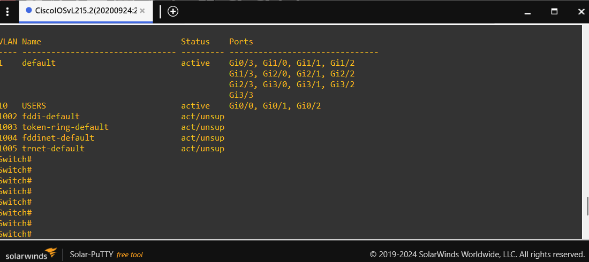

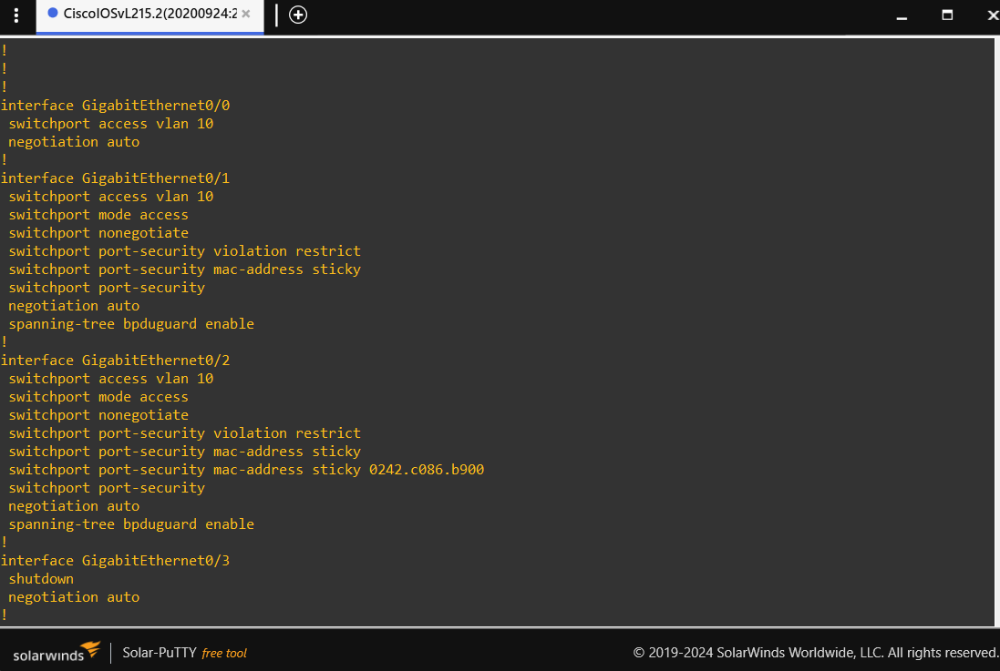

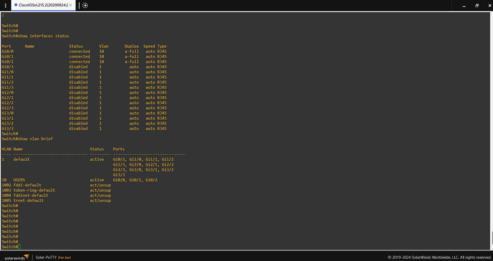

## 4.6 Final pre-submission review

Before pushing the project to GitHub:

- replace `VIDEO_URL` with the final video link;
- confirm all referenced screenshots exist using the exact filenames;
- add the real switch running-config;
- add the FortiGate configuration export after removing sensitive secrets;
- verify the submission file exactly matches the instructor's required filename format.
